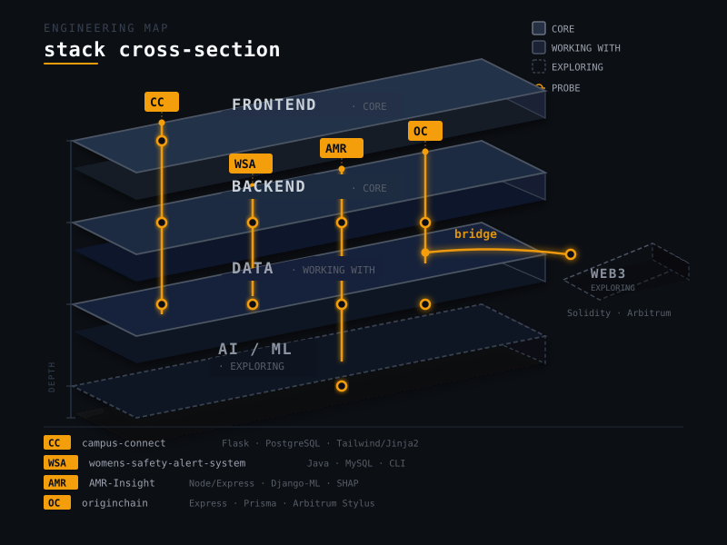

# Dhyey Daftary

---

### ~/ whoami

> Early-career engineer, still figuring out where full-stack ends and AI
> begins. Based in Ahmedabad, India. I write code that mostly works, and
> bugs that look intentional.

---

### ~/ currently building

**RSNA Knee Abnormality Detection** — Kaggle competition, predicting 12
clinically important knee abnormality findings from multimodal MRI (image and radiology report text at train
time, image-only at inference). The real
problem isn't the modeling — it's that only 58 of 4,407 training studies
carry direct labels; the rest have to be handled as a weak-supervision
problem built on noisy report-derived signal. Currently deep in data
verification: confirmed patient-level leakage isn't a risk (4,407 unique
patients, one study each, verified against DICOM headers), resolved
laterality coverage across manufacturers, and now designing a validation
strategy that can be trusted with a 58-study labeled core. No model
trained yet — getting the data and validation right first.

`Python · PyTorch · pydicom`

[github.com/dhyeydaftary/rsna-knee-abnormality-detection](https://github.com/dhyeydaftary/rsna-knee-abnormality-detection)

---

### ~/ toolbox

**Core**  

  
Node · Express · MongoDB — the MERN stack

**Working with**  

&nbsp;·&nbsp; Java

**Exploring**  

&nbsp;·&nbsp; AI/ML (SHAP-style explainable ML) · Web3 / Arbitrum

---

### ~/ engineering map

<picture>
  <source media="(prefers-color-scheme: dark)" srcset="assets/stack-cross-section-dark.svg">
  <source media="(prefers-color-scheme: light)" srcset="assets/stack-cross-section-light.svg">
  
</picture>

---

### ~/ selected work

<table width="100%">
<tr><td>
<b>campus-connect</b> 
Full-stack social platform for university communities — 90+ REST endpoints across 10 Flask blueprints, real-time chat over WebSockets, an 18-table PostgreSQL schema, 333 automated tests at 83% coverage. 
<code>Flask · PostgreSQL · Tailwind/Jinja2 · Socket.IO</code> 
<i>Creator, Lead Developer &amp; Architect — with Urva Shah (design) &amp; Twisha Agrawal</i> 
<a href="https://github.com/dhyeydaftary/campus-connect">github.com/dhyeydaftary/campus-connect</a>
</td></tr>
</table>

<table width="100%">
<tr><td>
<b>womens-safety-alert-system</b> 
Java-based real-time emergency response system — three-tier RBAC, FIFO alert dispatching, geospatial nearest-responder assignment, multithreaded background monitoring, MySQL/JDBC persistence. Singleton, Factory, and Observer patterns throughout. 
<code>Java · MySQL · JDBC</code> 
<i>Solo — Semester 2 coursework</i> 
<a href="https://github.com/dhyeydaftary/womens-safety-alert-system">github.com/dhyeydaftary/womens-safety-alert-system</a>
</td></tr>
</table>

<table width="100%">
<tr><td>
<b>AMR-Insight</b> 
Explainable ML platform predicting antibiotic resistance across 15 antibiotics — 15 CatBoost models with native SHAP explainability, WHO AWaRe classification, and Gemini-assisted lab-report extraction. 98 automated tests, a 13-phase security hardening pass. 
<code>Django/DRF · CatBoost · Node/Express · MongoDB</code> 
<i>ML backend &amp; gateway; led security hardening — with Urva Shah &amp; Ansh Patel (frontend)</i> 
<a href="https://github.com/dhyeydaftary/antibiotic-resistance-intelligence-platform">github.com/dhyeydaftary/antibiotic-resistance-intelligence-platform</a>
</td></tr>
</table>

<table width="100%">
<tr><td>
<b>originchain</b> 
Decentralized creator-identity and proof-of-origin platform on Arbitrum — client-side content hashing, IPFS pinning, on-chain registration via Rust/Stylus smart contracts, wallet-based auth via Sign-In With Ethereum. 
<code>Express · Prisma/PostgreSQL · Rust/Arbitrum Stylus · Next.js</code> 
<i>Backend &amp; smart contracts — built with Nandish Patel &amp; Frenil Patel</i> 
<a href="https://github.com/originchain-labs/originchain">github.com/originchain-labs/originchain</a> · <a href="https://originchain-dev.vercel.app/">Live</a>
</td></tr>
</table>

---

### ~/ contribution activity

<picture>
  <source media="(prefers-color-scheme: dark)" srcset="assets/contribution-calendar-dark.svg">
  <source media="(prefers-color-scheme: light)" srcset="assets/contribution-calendar-light.svg">
  
</picture>

---

### ~/ connect

